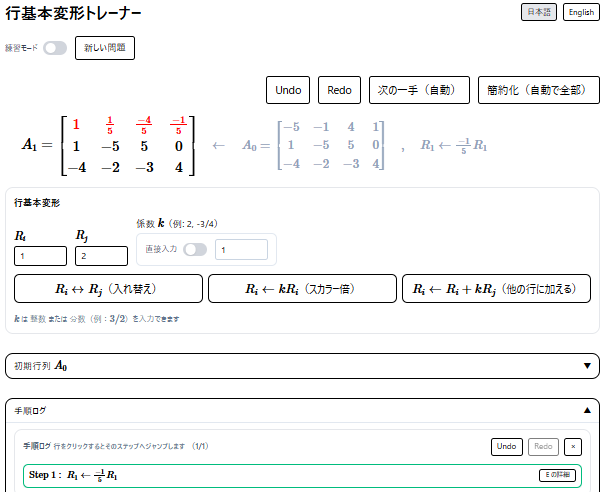
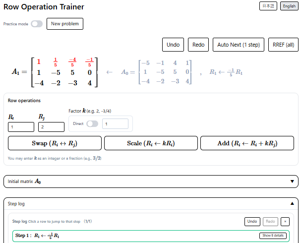

# Matrix RREF Trainer  
*A web app for practicing row operations, RREF reduction, and rank.*

---

# 日本語版

[日本語](#日本語版) | [English](#english-version)

## 📌 概要

**Matrix RREF Trainer** は、  
行基本変形・RREF（簡約化された行階段形）・階数計算を  
インタラクティブに学習できる Web アプリです。

- 手動の行基本変形（スワップ・倍倍・加算）
- RREF の自動計算（1 手ずつ / 一括）
- 初等行列の表示（任意ステップごと）
- 1 手前の行列の表示（変更箇所を色付きで表示）
- 行列を手入力（分数 / 整数）
- クイズモード（正解判定、ランク判定）
- i18n（日英切替）

など、教育用に特化した機能を搭載しています。

---

## 🌐 デモ（GitHub Pages）

👉 **https://tanaken-basis.github.io/mot-row/**  

---

## 🖼 スクリーンショット



---

## ✨ 特徴

### 🎯 1. 行基本変形の練習
- 行の交換 $R_i \leftrightarrow R_j$
- スカラー倍 $R_i \leftarrow k R_i$
- ある行の定数倍を他の行に足す $R_i \leftarrow R_i + k R_j$

すべて MathJax の TeX で表示され、教育的にわかりやすい UI です。

---

### ⚙ 2. 自動 RREF（Auto Next / 一括）
- 「次の一手」で 1 行 1 操作ずつ  
- 「RREF一括」で完全に簡約化  
- pivot の流れを **教科書的（左→右で完結）** に修正済み

---

### 🟨 3. 直前に変わった行をハイライト
- 文字色（textcolor）で変更点を強調
- 設定パネルで ON/OFF 切り替え

---

### 🧮 4. 階数（Rank）の学習
- **練習モード** → 設定 ON で常時表示  
- **クイズモード** → 「答え表示」を押すまで表示しない  
- 行列が正しく簡約化されており、かつランクも正しい場合に “正解” となる

---

### 📝 5. $A_0$（初期行列）の管理
- 現在の行列を $A_0$ に再設定  
- 手入力で $A_0$ を作成（分数対応）  
- $A_0$ はアコーディオンパネルで確認可能

---

### 🌍 6. 多言語（i18n）
- 日本語 / 英語 切り替え  
- MathJax と混在した文章にも対応した翻訳キー構成  
- 設定やボタンが両言語に完全対応

---

## 📦 セットアップ

### 1. 依存パッケージをインストール

```bash
npm install
````

### 2. 開発サーバを起動

```bash
npm run dev
```

### 3. 本番ビルド

```bash
npm run build
```

---

## 📁 ディレクトリ構成

```
src/
 ├── components/
 ├── math/
 ├── tex/
 ├── i18n/
 ├── App.jsx
 └── main.jsx
```

---

---

# English Version

[日本語](#日本語版) | [English](#english-version)

## 📌 Overview

**Matrix RREF Trainer** is an interactive web application
for learning:

* Elementary row operations
* RREF (Reduced Row Echelon Form)
* Rank
* Step-by-step reduction
* Quiz mode (with answer checking)

It is designed for education, teaching, and linear algebra practice.

---

## 🌐 Demo (GitHub Pages)

👉 **https://tanaken-basis.github.io/mot-row/**

---

## 🖼 Screenshots



---

## ✨ Features

### 🎯 1. Practice row operations

Displayed using clear MathJax expressions:

* Row swap $R_i \leftrightarrow R_j$
* Scaling $R_i \leftarrow k R_i$
* Row addition $R_i \leftarrow R_i + k R_j$

---

### ⚙ 2. Auto RREF

* **Auto Next** → applies one step at a time
* **RREF All** → completes reduction in one shot
* Algorithm tuned for **textbook-style left-to-right elimination**

---

### 🟨 3. Highlight updates

Recently changed rows are colored using `textcolor{}` (MathJax + color package).

---

### 🧮 4. Rank calculation

* **Practice mode:** always visible
* **Quiz mode:** hidden until “Show Answer”
* Correctness requires both:

  * Matrix reduced correctly
  * Rank matches expected value

---

### 📝 5. $A_0$ (Initial Matrix)

* Reset current matrix as $A_0$
* Manual editor (supports fractions)
* Accordion panel for reviewing $A_0$

---

### 🌍 6. i18n support

* Japanese & English
* Works smoothly with MathJax text
* Configurable translation keys

---

## 📦 Setup

### 1. Install dependencies

```bash
npm install
```

### 2. Start dev server

```bash
npm run dev
```

### 3. Build for production

```bash
npm run build
```

---

## 📁 Directory Structure

```
src/
 ├── components/
 ├── math/
 ├── tex/
 ├── i18n/
 ├── App.jsx
 └── main.jsx
```
